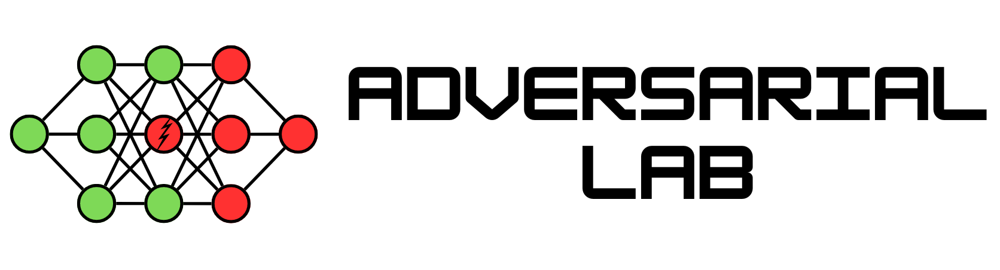

<h1 align="center">
  <br>
  <a href="assets/banner.png" alt="Adversarial Lab">
    
  </a>
  <br>
  Adversarial Lab
  <br>
</h1>

<p align="center">Adversarial Lab is a comprehensive Python library designed for launching adversarial attacks on any machine learning model. It is framework-agnostic, supporting both TensorFlow and PyTorch, making it a versatile tool for evaluating model robustness in different environments.</p>

<p align="center">
  <a href="#key-features">Key Features</a> •
  <a href="#installation">Installation</a> •
  <a href="#quick-start">Quick Start</a> •
  <a href="#usage">Usage</a> •
  <a href="#customization">Customization</a> •
  <a href="#contributing">Contributing</a> •
  <a href="#license">License</a>
</p>


## Key Features

- **Framework Agnostic:** Works seamlessly with both TensorFlow and PyTorch.
- **Wide Range of Attacks:** Includes both black-box and white-box attack implementations.
- **Customizable Loss Functions and Optimizers:** Easily extendable to custom loss functions and optimization techniques.
- **Noise Generators:** Supports various noise generation methods to craft adversarial examples.
- **Defenses:** Built-in methods to evaluate and defend against adversarial attacks.

## Installation

To install Adversarial Lab, you can use pip. The pip installation does not install tensorflow and pytorch. Both these libraries must be installed for Adversarial Lab to work.

```bash
pip install adversarial-lab
```

## Quick Start

Here's a basic example to get you started with a white-box attack on a PyTorch model:

```python
from PIL import Image
import tensorflow as tf
from tensorflow.keras.applications import InceptionV3
from adversarial_lab.attacks.whitebox import WhiteBoxMisclassification

image = Image.open('data/panda.jpg')
model = InceptionV3(weights='imagenet')

attacker = WhiteBoxMisclassification(model, "cce", "adam")
noise = attacker.attack(image_array, epochs=20, strategy="random", verbose=3)
```

## Usage

### Attacks

Adversarial Lab supports a variety of adversarial attack techniques. Here's a brief overview:

- **Black-Box Attacks:** Located in `adversarial_lab/attacks/blackbox`
- **White-Box Attacks:** Located in `adversarial_lab/attacks/whitebox`

### Defenses

COMING SOON

## Customization

Adversarial Lab is designed to be extensible. You can add your custom components in the following areas:

- **Loss Functions:** Create your own loss functions in `adversarial_lab/core/losses`.
- **Optimizers:** Extend or modify optimizers in `adversarial_lab/core/optimizers`.
- **Noise Generators:** Implement new noise generators under `adversarial_lab/core/noise_generators`.

## Contributing

We welcome contributions to Adversarial Lab! If you'd like to contribute, please follow these steps:

For detailed guidelines, see the `CONTRIBUTING.md` file.

## License

This project is licensed under the terms of the MIT license. See the [LICENSE](LICENSE) file for details.